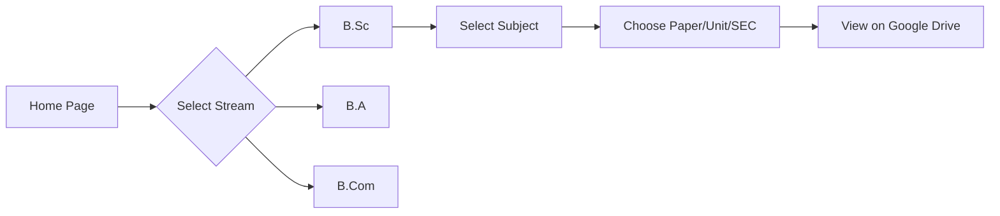

# 🎓 Academic Question Bank System

A structured, web-based Question Bank Platform designed for undergraduate students across B.Sc, B.A, and B.Com streams. The system provides easy access to **2500+ question papers** organized subject-wise with a clean and scalable file architecture.


---

## 📌 Project Overview

The Academic Question Bank System is a lightweight, static web project that allows students to browse, select, and view previous year question papers efficiently.

### 🎓 Supported Streams

The platform currently supports:

- **B.Sc** (Bachelor of Science)
- **B.A** (Bachelor of Arts)  
- **B.Com** (Bachelor of Commerce)

Each stream contains **30+ subjects**, and every subject is structured in a consistent and scalable way.

---

## 🧩 Project Structure

---

## 📊 Content Scale

| Category | Quantity |
|----------|----------|
| 📚 Subjects per stream | 30+ |
| 📄 Files per subject | 16 |
| 📁 SEC module files | 4+ |
| 📝 Total Question Papers | **2500+** |
| ☁️ Storage Type | Google Drive |

---

## 🔗 Content Delivery

Instead of storing heavy PDF files locally, this system uses:

- **Google Drive hosted question papers**
- **Direct access links** embedded into each page
- **Fast loading** and low server usage

This makes the project:

- ⚡ **Lightweight**
- 🚀 **Fast** 
- 🔄 **Easy to update**
- 💰 **Cost-effective**

---

## 🖥️ User Flow



---

## 💻 Tech Stack

| Technology | Purpose |
|------------|---------|
| **HTML5** | Structure & Content |
| **CSS3** | Styling & Layout |
| **JavaScript** | Interactivity |
| **Google Drive** | Cloud Storage |
| **Anchor Links** | Navigation |

---

## ✨ Key Features

| Feature | Description |
|---------|-------------|
| ✅ **Clean Navigation** | Structured subject-wise browsing |
| ✅ **Consistent Layout** | Uniform design across all streams |
| ✅ **SEC Modules** | Separated Skill Enhancement Courses |
| ✅ **Cloud Hosted** | All papers on Google Drive |
| ✅ **Responsive UI** | Works on all devices |
| ✅ **No Database** | Pure static files |
| ✅ **Scalable** | Easy to add new content |
| ✅ **Fast Loading** | No heavy PDF files locally |

---

## 🚀 Future Enhancements

| Feature | Description |
|---------|-------------|
| 🔍 **Search functionality** | Find papers by keywords |
| 👤 **Student login/dashboard** | Personalized experience |
| ⭐ **Bookmark papers** | Save important papers |
| 📊 **Usage analytics** | Track popular papers |
| 📥 **Download tracking** | Monitor paper access |
| 🤖 **AI-based recommendations** | Smart paper suggestions |

---

## 🔗 Quick Start

Follow these simple steps to get started with the project:

### 📥 Clone the repository
```bash
git clone https://github.com/sameer76-byte/CU-Archive.git
```

### 📂 Navigate to project directory
```bash
cd CU-Archive
```

### 🌐 Open in browser
```bash
open index.html
```
---

## 💻 Live Demo

Visit the live site: **[https://sameer76-byte.github.io/CU-Archive](https://sameer76-byte.github.io/CU-Archive)**

---

## 🛠️ Contributing

Contributions are welcome! Follow these steps to contribute:

| Step | Action | Command |
|------|--------|---------|
| 1️⃣ | 🍴 **Fork** the repository | Click "Fork" on GitHub |
| 2️⃣ | 🌿 **Create** feature branch | `git checkout -b feature/YourFeature` |
| 3️⃣ | 💾 **Commit** changes | `git commit -m "Add Your Feature"` |
| 4️⃣ | 📤 **Push** to branch | `git push origin feature/YourFeature` |
| 5️⃣ | 🔍 **Open** Pull Request | Click "New Pull Request" on GitHub |

---

## 👨‍💻 Developer

<div align="center">
    <h3>Sameer Prasad</h3>
    <p><em>B.Sc Computer Science Student</em></p>
    <p>Building scalable and practical academic tools.</p>
    <br>
    <p>📧 <strong>Email:</strong> <a href="mailto:sameerprasad980@gmail.com">sameerprasad980@gmail.com</a></p>
    <p>🔗 <strong>GitHub:</strong> <a href="https://github.com/sameer76-byte">@sameer76-byte</a></p>
</div>
---

## ⭐ Support

If you found this project useful:

<div align="center">
<table>
  <tr>
    <td align="center">⭐</td>
    <td><strong>Star</strong> the repository</td>
  </tr>
  <tr>
    <td align="center">🍴</td>
    <td><strong>Fork</strong> it for your institution</td>
  </tr>
  <tr>
    <td align="center">📢</td>
    <td><strong>Share</strong> with fellow students</td>
  </tr>
</table>

<br>
<br>

<h3>Made with ❤️ for students, by a student</h3>

<a href="https://github.com/sameer76-byte/CU-Archive/stargazers">
  
</a>
<a href="https://github.com/sameer76-byte/CU-Archive/network/members">
  
</a>
</div>
